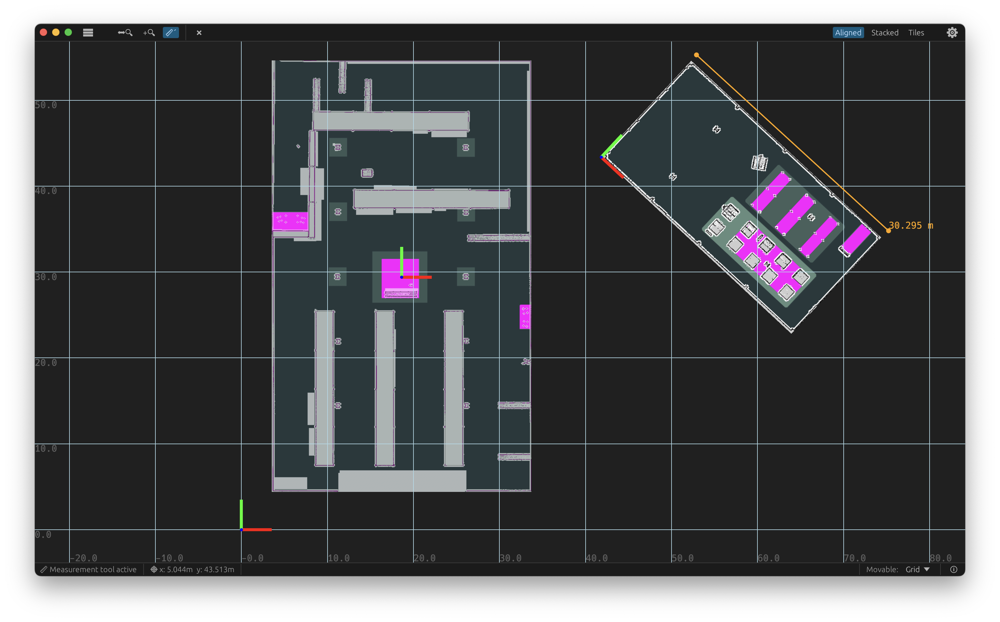

Mobile robot example maps showing a warehouse and depot with localization map, keepout and speed zone costmaps.
Based on the [Nav2 bringup example](https://github.com/ros-navigation/navigation2/tree/main/nav2_bringup) files.

This example illustrates how you can show multiple map layers, floors/buildings with different poses, colormaps, blending and draw order in the `maps` app.

To open it with `maps`, `cd` into this directory and either open the example session:

```sh
maps -s session.toml
```



Or open individual maps, for example:

```sh
maps warehouse.yaml depot.yaml
```
